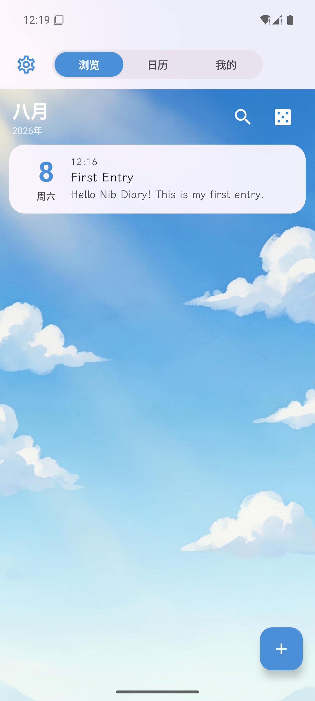
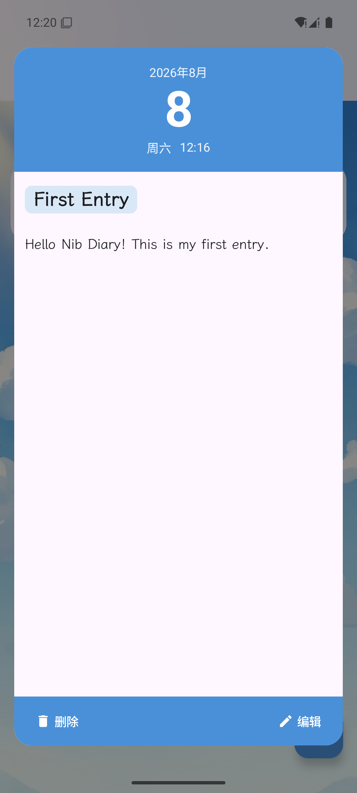
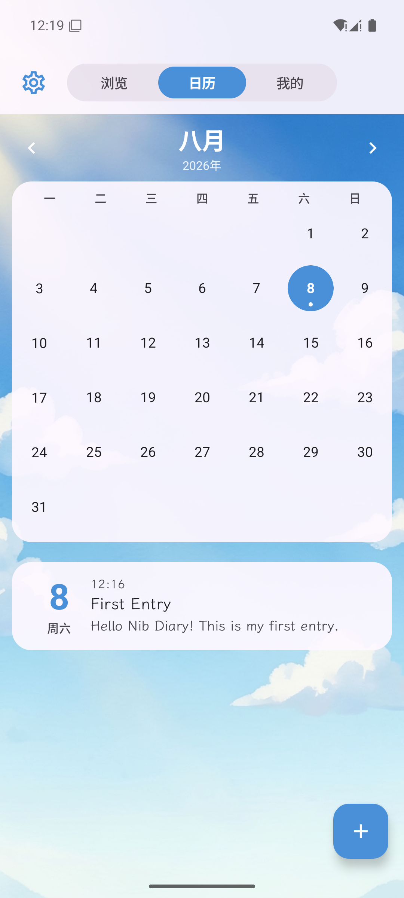
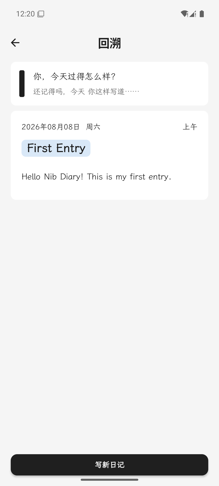

# Nib Diary

一款自托管的安卓日记应用：手写风格排版，数据完全属于你自己——所有日记同步到你自己的服务器，不经过任何第三方。

<p align="center">
  
  
  
  
</p>

## 功能

- **日记条目**：标题 / 正文（图片内嵌于正文）/ 心情 / 天气 / 日期，每天一篇（凌晨 4 点前归前一天）
- **浏览**：按月分组列表，搜索（标题 / 段落 / 子标题）与随机回溯
- **日历**：月视图打点，选中日期直接看当天日记
- **我的**：统计概览（篇数 / 字数 / 图片数）与媒体库（瀑布流预览、全屏查看）
- **编辑**：图片 / 时间戳 / 小标题 / 心情 / 天气 / 日期工具栏，块插入在光标位置
- **阅读**：手写体 + 荧光笔标题 + 小标题竖线 + 时间戳 chip 的统一块渲染
- **同步**：离线优先，后写覆盖（LWW）+ 软删除 + 增量同步，手机与服务器互为备份
- **外观**：主题色跟随背景图、卡片全局透明度、动态黑白顶栏、深色模式

## 截图与安装

最新安装包（APK）见 [Releases](https://github.com/seasideshell405/Nib-Diary/releases)。

## 技术栈

| 端 | 技术 |
| --- | --- |
| 安卓客户端 | Kotlin + Jetpack Compose + Room |
| 服务器 | Go + SQLite（图片文件存储） |

## 目录结构

```
android/   安卓客户端
server/    Go 服务器（见 server/DEPLOY.md）
docs/      术语表（CONTEXT.md）、ADR、规格
```

## 快速开始

### 服务器

```bash
export DIARY_TOKEN="一个随机长字符串"
export DIARY_ADDR=":8080"          # 可选，默认 :8080
cd server
go run ./cmd/server
```

服务器需启用 HTTPS；详细部署见 [server/DEPLOY.md](server/DEPLOY.md)。

### 安卓

```bash
cd android
./gradlew :app:assembleRelease
```

应用内「设置」页填写服务器地址与 Token，首次连接即完成全量恢复。
